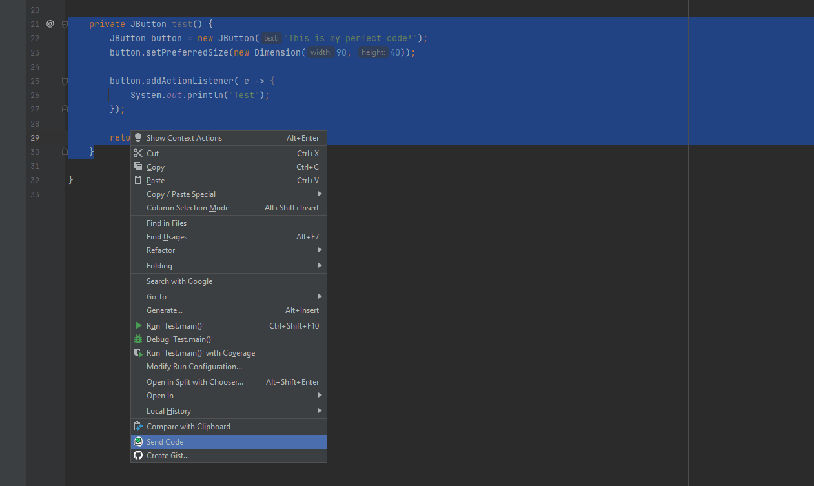
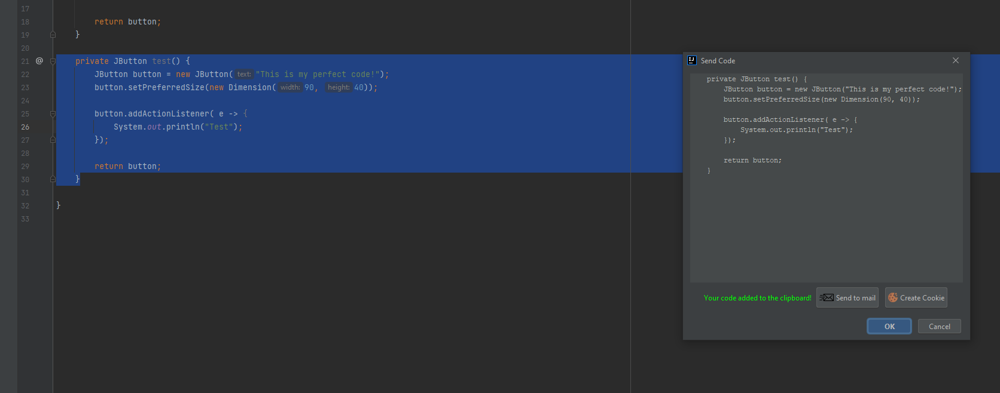

# AxCookie Plugin for IntelliJ IDEA
Plugin for save and share your code. Sending to mail and social networks.

## General information
- To get information about how to install and use this plugin in IDEA, 
  please use IntelliJ IDEA online help.
  
- If you have any question about the AxCookie plugin, 
  we'd be glad to answer it in our developer community or in our gitter channel.
  
- If you found a bug, please report it on our issue tracker or send report it on our mail.

- If you want to contribute, please see our intro to the Scala plugin internals.

## Getting started

1. Highlight the code you want to send.
2. Click the right mouse button to open the context menu.
3. Click on [Send Code]().

A window with the selected code will appear in front of you. 
The code will be automatically copied to the clipboard. 
Then you can send the code by mail or create a cookie.

